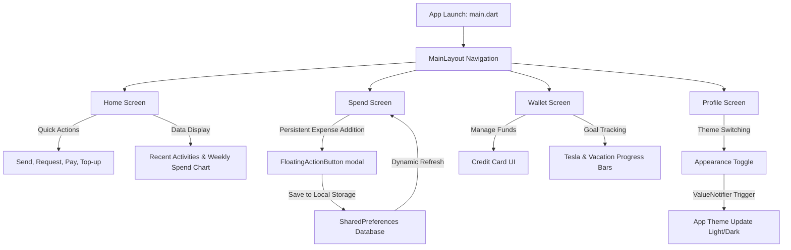

# Expense Tracker 📱💸

A premium, dark-mode first personal finance and expense tracking application built using **Flutter**. The application features a state-of-the-art interactive dashboard, savings tracker, comprehensive spending statistics, persistent local storage, and smooth light/dark mode transitions.

---

## 🎨 UI Design & AI Collaboration

This application was designed and developed through a hybrid human-AI pair programming workflow:
* **UI/UX Design**: The screen layouts, design tokens, and user interface elements were built using **Google Stitch**.
* **AI Assistance & Code Generation**: The complete application logic, state management, complex layouts, interactive charts, persistent storage, and dark-theme configurations were generated and developed with **Google DeepMind's Antigravity AI Agent**.

---

## 🚀 App Features & Working Flow

The application features a single-activity layout with a bottom navigation bar (`MainLayout`) that lets the user navigate across four main features:



### 1. 🏠 Home Screen (Dashboard)
* **Balance & Limits**: Displays the current total balance ($12,480.00) alongside daily and monthly limits.
* **Quick Actions**: Includes quick-access buttons for *Send*, *Request*, *Pay*, and *Top-up*.
* **Weekly Insights Chart**: Utilizes `fl_chart` to render a modern bar chart representing weekly expenditures.
* **Recent Activities**: A feed displaying recent financial transactions.

### 2. 📊 Spend Screen (Expense Tracking)
* **Monthly Spend Overview**: Shows total monthly spending with an interactive percentage change indicator.
* **Category Carousel**: A horizontally scrollable list showing spending by categories (e.g., Food, Travel, Shopping).
* **Expense Addition Flow**:
  1. User taps the floating `+` button.
  2. A sliding modal sheet appears asking for *Amount*, *Title*, and *Category*.
  3. Clicking **Add Expense** saves the record locally using `SharedPreferences`.
  4. The list dynamically refreshes to display the newly added item instantly in the transaction history.

### 3. 💳 Wallet Screen (Accounts & Goals)
* **Premium Virtual Card**: A visually stunning digital debit card containing key details.
* **Savings Goals**: Tracking components with progress indicators for long-term saving achievements (e.g., *Tesla Roadster* or *Summer Vacation*).
* **Linked Accounts**: Lists connected banking accounts for unified management.

### 4. 👤 Profile Screen (Settings & Appearance)
* **Appearance Toggle**: A dynamic switch to toggle between **Light Mode** and **Dark Mode**. Toggling this updates a global `ValueNotifier<ThemeMode>`, triggering an instantaneous application-wide theme transition without restarting the app.
* **Account Controls**: Access to *Account Details*, *Security*, and *Notifications*.

---

## 📁 Project Folder Structure

The codebase is organized in a clean, modular structure under the `lib/` directory:

```text
lib/
├── main.dart                 # App Entry point & ValueNotifier setup for Theme Mode
├── screens/                  # Application UI Views / Screens
│   ├── main_layout.dart      # Bottom Navigation container & page router
│   ├── home_screen.dart      # Dashboard with balance, quick actions & bar chart
│   ├── spend_screen.dart     # Expense statistics, transaction list & expense modal
│   ├── wallet_screen.dart    # Virtual credit card & progress tracker for saving goals
│   └── profile_screen.dart   # Profile settings & Light/Dark appearance controller
└── theme/                    # Application Styling & Theming
    └── app_theme.dart        # Configured Light & Dark ThemeData parameters
```

---

## 🛠️ Technology Stack Used

* **Flutter & Dart**: Cross-platform application framework for native performance.
* **Shared Preferences (`shared_preferences`)**: Local key-value database for storing custom expense entries persistently.
* **FL Chart (`fl_chart`)**: Highly customizable chart library to draw beautiful insights and bar graphs.
* **Lucide Icons (`lucide_icons`)**: Crisp, clean, vector icons used consistently throughout the interface.
* **Google Fonts (`google_fonts`)**: Powering the application typography via the premium **Inter** font family.

---

## 📱 How to Run and Use the App

### Prerequisites
Make sure you have [Flutter SDK](https://docs.flutter.dev/get-started/install) installed on your development machine.

### Installation & Run Steps
1. **Clone & Navigate**:
   ```bash
   cd spendapp
   ```
2. **Fetch Dependencies**:
   ```bash
   flutter pub get
   ```
3. **Launch Simulator/Emulator**:
   Start your target Android Emulator, iOS Simulator, or connect a physical debugging device.
4. **Run the Project**:
   ```bash
   flutter run
   ```

### Exploring the App
* **Log a Custom Expense**: Go to the **Spend** tab, tap the floating `+` action button, input details, and save. The new transaction will be instantly appended.
* **Toggle Themes**: Go to the **Profile** tab, look for **Appearance**, and flip the switch to seamlessly toggle between the Dark and Light UI themes.
# Expense-Tracker
